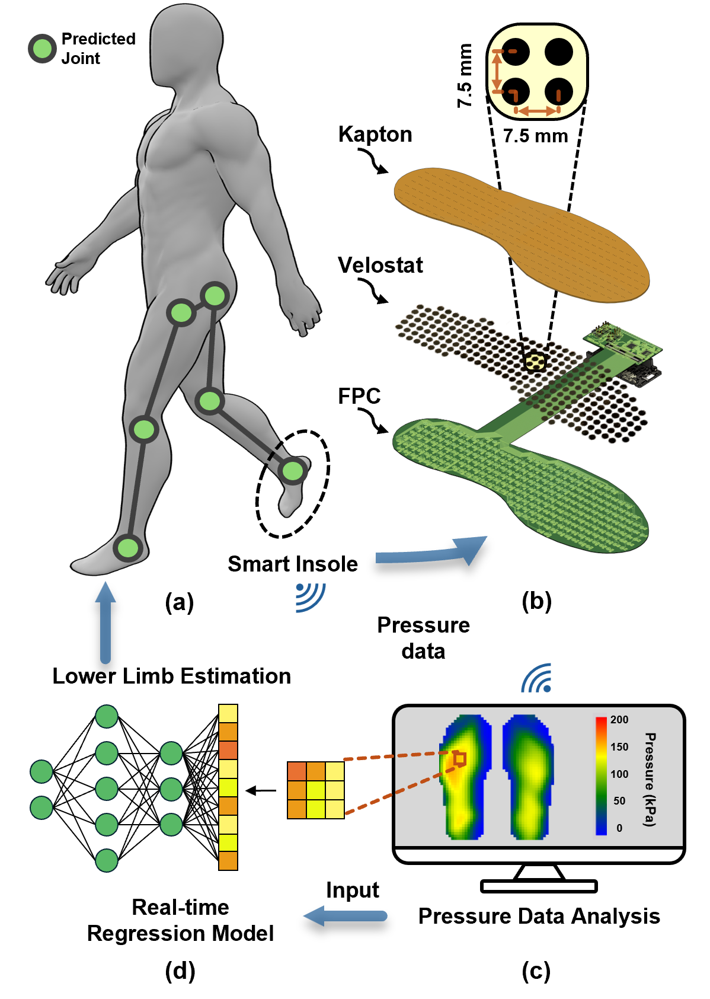

# 🦶 Smart Insole System for Gait Sensing and Health Monitoring

> A prototype for plantar pressure measurement for gait analysis

---

## 🖼️ Project Overview
<!-- 建议这里插入一张项目整体图或实物照片 -->

  

This repository contains the **Smart Insole System** project, developed for human gait sensing and health monitoring applications.  
It includes two main design iterations presented at ISCAS 2025 and ISCAS 2026

---

## 📁 Repository Structure
Git_Insole/
├── README.md
├── Potential_Divider_Solution/        # ISCAS 2025 version (Potential Divider-based sensing)
│   ├── PCB/                           # Circuit schematic and layout
│   ├── Software_Code/                 # MCU firmware and configuration
│   ├── DataCollection/                # Data acquisition scripts (if applicable)
│   ├── Documents/                     # Paper, demo slides, and related materials
│   └── README.md                      # Version-specific documentation
├── Double_Sensing_Solution/           # ISCAS 2026 version (Dual-sensing hybrid design)
│   ├── 3D_Model/                      # Mechanical insole and sensor placement models
│   ├── DataCollection/                # Experimental data scripts and analysis
│   ├── ESP_MCU_Code/                  # Firmware for dual-sensor system
│   ├── Multisim_Simulation/           # Analog front-end circuit simulations
│   ├── PCB/                           # Hybrid PCB design and schematic
│   ├── WiFi_Server_Code/              # Host-side code for wireless data transfer
│   └── README.md                      # Version-specific documentation
└── docs/                               # Images used in README

---

## 🧩 Version Overview

| Version | Year | Core Method | Highlights |
|----------|------|-------------|-------------|
| **ISCAS 2025** | Potential Divider Circuit 
| **ISCAS 2026** | Dual-Sensing Hybrid Design

---

